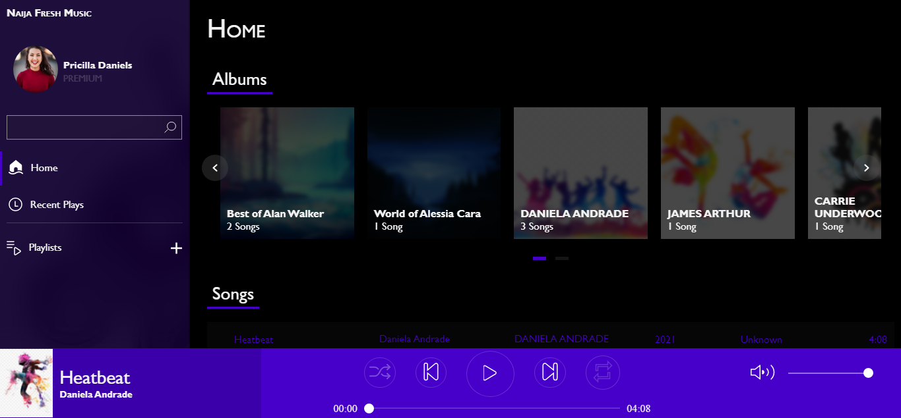

# Music Player

This is a music player built for the web.

I envisioned the great need of an offline browser music player, as not so many internet users stream music. For this reason, i decided to work on an offline, browser
based music player to meet the demands of many internet users.

## Table of contents

- [Overview](#overview)
  - [Screenshot](#screenshot)
  - [Links](#links)
- [My process](#my-process) -[Features](#features)
  - [Built with](#built-with)
  - [What I learned](#what-i-learned)
  - [Continued development](#continued-development)

## Overview

### Screenshot

### Links

- Solution URL: https://github.com/nuel1/musicplayer.github.com
- Live Site URL: https://brave-brattain-094318.netlify.app/

## My process

### Features

With modern music playing features incorperated in the player, it offers a well pleasing music playing experience to users as it gives so much flexibility and control
over your music. As it allows users to:

- Search for their favorite music quickly.
- Create and modify playlist.
- View recently played songs.
- Navigate through songs quickly and easily.
- View albums of certain artists.
- And much more...

### Built with

- Semantic HTML5 markup
- CSS custom properties
- Flexbox
- CSS Grid
- Vanilla Javascript

### What I learned

I learnt how to work with Javscript Audio constructor function, which helped in creating this complete and functional music player from scratch.

### Continued development

Functional programming is a pattern i mostly use when i program. However, writing clean and maintainable code are the attribute of a good Developer. Therefore, as an
aspiring Frontend Developer, i look forward to improving my coding style by developing the habit of writing clean and maintainable code.
